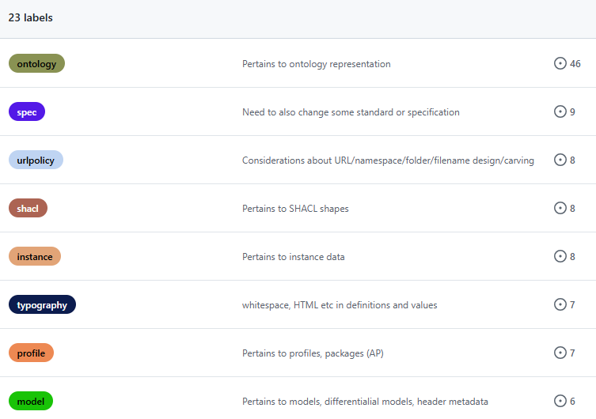
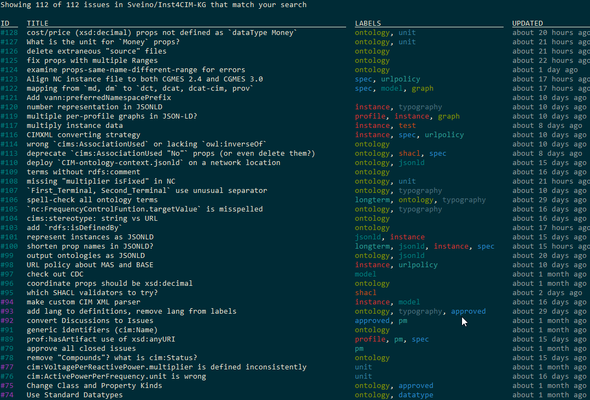

# Instance of CIM Knowledge Graph
<!-- markdown-toc start - Don't edit this section. Run M-x markdown-toc-refresh-toc -->
**Table of Contents**

- [Instance of CIM Knowledge Graph](#instance-of-cim-knowledge-graph)
    - [Overview](#overview)
    - [Purpose](#purpose)
    - [Folders](#folders)
    - [Files](#files)
    - [Key Components](#key-components)
    - [Schema profiling](#schema-profiling)
        - [RDF Syntaxes for profiling](#rdf-syntaxes-for-profiling)
        - [Ontology Improvements](#ontology-improvements)
    - [Instance Data](#instance-data)
    - [Issue Tracking](#issue-tracking)
        - [Github CLI](#github-cli)
        - [Issues in README](#issues-in-readme)
        - [Project Management Issues](#project-management-issues)
    - [Resources](#resources)
    - [Contributing](#contributing)
    - [License](#license)

<!-- markdown-toc end -->

## Overview

The **Instance of CIM Knowledge Graph** project focuses on producing issue resolutions and example files that demonstrate how the IEC Common Information Model (CIM) can be upgraded to support the latest W3C standards. The project includes schema ontologies and instance data, utilizing profiles such as **CGMES 3.0** and **Network Code (NC) CGMES extensions**. It also validates **DX-PROF** and incorporates the **LinkML** project to model CIM data cases.

## Purpose

The project aims to:
- Create example cases that cover all relevant CIM modeling scenarios using JSON-LD, Turtle, and RDF/XML.
- Address issues and provide examples for all relevant modeling of CIM.
- Demonstrate how CIM can support W3C standards for both schema and instance data.

## Folders
- .github: issue templates for creating 5 types of issues
- .vscode: settings for the VSCode IDE
- archive (`DiagramLayoutExample_v15July2020\, PROF-AP-CIM_v15July2020\`)
- rdf-improved: improved representation of CIM instance data (Trig and JSON-LD)
- rdfs-improved: improved representation of CIM ontologies (Turtle and JSON-LD)
- shacl-improved: improvement proposals for CIM SHACL validation shapes
- schemas: draft LinkML schemas (for now has only 6)
- source: OCL, RDFS2020, RDFSEd2Beta, SHACL files for the CGMES and CGMES-NC ontologies
- voc: currently empty

## Files

- .gitignore: files that will not be committed to github
- LICENSE: this work is licensed under the Apache 2.0 License
- README.md: this file
- issue-gh-list.png: shows using the `gh` CLI utility to list issues
- issue-labels.png: shows issue labels defined for this repository
- Makefile: `make issues` makes the issue lists below (see also [Issue Tracking](#issue-tracking))
- issues-all.tsv: all issues in github
- issues-README.txt: issues described in README files
- issues-missing.tsv: issues missing from README files

## Key Components

1. **CGMES 3.0 Profile**: Applying the latest CIM profiles in compliance with CGMES standards.
2. **NC CGMES Extensions**: Extending the existing Network Code CGMES to support specific use cases.
3. **LinkML**: LinkML project to produce CGMES 3.0 and Network Code (NC) extensions.
4. **Example model**: Example of all relevant CIM modelling concept.


## Schema profiling

The project will show example of the generation of [RDFS-plus](http://mlwiki.org/index.php/RDFS-Plus) based vocabulary and [Shapes Constraints Language (SHACL)](https://www.w3.org/TR/shacl/) from [LinkML](https://linkml.io/) with the profile structure according to [**W3C DX-PROF**:](https://www.w3.org/TR/dx-prof/).

### RDF Syntaxes for profiling

The CIM profiles should be possible to be described with all RDF Syntaxed. However, the following RDF Syntaxes are planed to be generated and tested:
- [**JSON-LD 1.1 Specification**](https://www.w3.org/TR/json-ld11/) The most advance syntax. Support multiple graphs. Primary for machine-understandable. There could be some feature that would only be supported in JSON-LD and most like will the other syntax be generated based on an JSON-LD instance.
- [**Turtle 1.1 Specification**:](https://www.w3.org/TR/turtle/) Focused on human readability.
- [**RDF/XML 1.1 Specification**](https://www.w3.org/TR/rdf-syntax-grammar/): Focused to provide backwards support. For application that support todays profile syntax to have a smaller upgrading path.

### Ontology Improvements

The folder [rdfs-improved](rdfs-improved) discusses a number of needed improvements to CIM/CGMES ontologies
- It implements many of them through SPARQL Updates
- It also includes Turtle and JSON-LD renditions of the latest CGMES and CGMES-NC ontologies

## Instance Data

Today CIM instance data is exchanged in CIM RDF (a variand of RDF XML) specified according to IEC 61970-553 (IEC 61970-600-1:2021 do deviate from this standard on some items). We would like to look into how we can create a converter from CIM XML to JSON-LD and reversal. There should be no loss going from CIM XML to JSON-LD, but it is assumed that there might be losses going the other way.
- The focus is on how to use JSON-LD for exchanging structure data, however it could also be looked at how to do scheduling and streaming data. The goal would be to have one syntax that can handle all relevant exchange types.
- The current focus is Trig (Turtle with graphs) and JSON-LD 1.1, but in general is should be possible to use any of the other RDF syntax as long as the required features (including named graphs) are supported in the given RDF syntax. 
- We expect to leverage Trig and JSON-LD features to be able to exchange difference models. 

The folder [rdf-improved](rdf-improved) discusses a number of needed improvements to CIM/CGMES instance data
- It implements conversion from the custom CIM XML format to standard Trig, and thereon JSON-LD
- It includes Trig and JSON-LD examples in the "test" subfolder

## Issue Tracking
We practice meticulous issue management to post and discuss all relevant issues.
- Whenever a new topic spawns off from an existing issue, we raise a new related issue to better organize the work:
- We use [labels](https://github.com/Sveino/Inst4CIM-KG/labels) for a better overview:



### Github CLI
For easier Github and issue management from the command line, you can try this tool:
- Install the Github CLI from https://cli.github.com/ 
- Do the `gh auth login` workflow
- Ensure you have `-R` in your [less](https://man7.org/linux/man-pages/man1/less.1.html) settings so that ANSI-color escape sequences are interpreted in your shell. Eg in my case:
```
set LESS=efij3wMqsx2R
```
- Try `gh issue ls -s all -L 1000` :




### Issues in README
In most cases, we describe issues in relevant README files to discuss deeper conceptual questions, and to record decisions.
We periodically compare issues in READMEs against issues in Github:

```
gh issue ls -s all -L 1000 --json url,title -q 'sort_by(.url) | .[] | [.url, .title] | @tsv' > issues-all.tsv
perl -ne 'print "$1\n" while m{(https://github.com/Sveino/Inst4CIM-KG/issues/\d+)}g' README.md */README.md | sort | uniq > issues-README.txt
cut -f1 issues-all.tsv | comm -3 - issues-README.txt | join - issues-all.tsv > issues-missing.tsv
```
Running this on 11-Nov-2024 showed these counts:
```
wc -l issues-*
   47 issues-README.txt
  112 issues-all.tsv
   65 issues-missing.tsv
```
So now I need to go through 65 issues to put them in READMEs and summarize or describe them in more detail.

Note: `make issues` runs all these commands.

### Project Management Issues

[labels/pm](https://github.com/Sveino/Inst4CIM-KG/labels/pm) (or `gh issue ls --label pm -s all`) lists issues that pertain to Project Management:
- https://github.com/Sveino/Inst4CIM-KG/issues/48 review issue labels (tags): considerations for label evolution
- https://github.com/Sveino/Inst4CIM-KG/issues/54 migrate Vladimir's issues from CIM4NoUtility: this is an older project, and we need to ensure all relevant issues have been reflected here
- https://github.com/Sveino/Inst4CIM-KG/issues/79 approve all closed issues: periodically go through [closed issues assigned to Sveino that have no label `approved`](https://github.com/Sveino/Inst4CIM-KG/issues?q=is%3Aissue+is%3Aclosed+-label%3Aapproved+assignee%3Asveino), and approve the resolution

Done:
- https://github.com/Sveino/Inst4CIM-KG/issues/1 Add initial structure and documents
- https://github.com/Sveino/Inst4CIM-KG/issues/3 Upload NC r2.3.1
- https://github.com/Sveino/Inst4CIM-KG/issues/92 convert Discussions to Issues


## Resources

- **Primary Sources for Instance Data**: 
  - [JSON-LD 1.1](https://www.w3.org/TR/json-ld11/) 

## Contributing

Contributions to this project are welcome. If you'd like to help with documentation, standards alignment, or the creation of examples, please follow the [contribution guidelines](CONTRIBUTING.md).

## License

This project is licensed under the [Apache-2.0 license](LICENSE). Please see the LICENSE file for more information.

