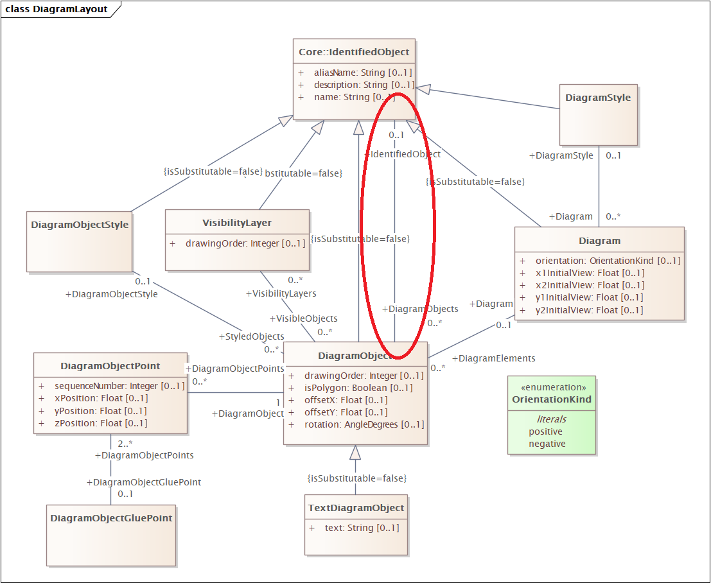

# CIM/CGMES SHACL Improvements

CIM/CGMES SHACL shapes are very important to ensure data quality and data interoperability,
and are the basis of the CGMES Conformance Testing program.
However, CGMES shapes are complex, and it is not surprising that various improvements can be implemented.

<!-- markdown-toc start - Don't edit this section. Run M-x markdown-toc-refresh-toc -->
**Table of Contents**

- [CIM/CGMES SHACL Improvements](#cimcgmes-shacl-improvements)
    - [Test Scenarios](#test-scenarios)
        - [Test Data](#test-data)
        - [In-memory vs On-disk Databases and Incremental Validation](#in-memory-vs-on-disk-databases-and-incremental-validation)
        - [Malformed Data Tests](#malformed-data-tests)
        - [Validating a Difference Model](#validating-a-difference-model)
    - [SHACL Engines and Requirements](#shacl-engines-and-requirements)
        - [Flexible Specification of dataGraph](#flexible-specification-of-datagraph)
        - [Useful/Readable ValidationReports](#usefulreadable-validationreports)
        - [Limit Number of Violations](#limit-number-of-violations)
    - [SHACL Improvements](#shacl-improvements)
        - [Write SHACL for the Spec Not for a Specific Implementation](#write-shacl-for-the-spec-not-for-a-specific-implementation)
        - [Check for Syntax Errors](#check-for-syntax-errors)
        - [Check for Internal Consistency](#check-for-internal-consistency)
            - [Each NodeShape Should have a Property](#each-nodeshape-should-have-a-property)
            - [All PropertyShapes Should be Used](#all-propertyshapes-should-be-used)
        - [Avoid Fake Target Nodes](#avoid-fake-target-nodes)
        - [Leverage rdfs:subClassOf Reasoning](#leverage-rdfssubclassof-reasoning)
            - [Properties are Attached to Sibling Domains](#properties-are-attached-to-sibling-domains)
            - [Properties Target Sibling Ranges](#properties-target-sibling-ranges)
        - [Don't Overuse rdf:type Checks](#dont-overuse-rdftype-checks)
        - [Don't Overuse sh:in](#dont-overuse-shin)
        - [Don't Overuse SHACL SPARQL](#dont-overuse-shacl-sparql)
            - [Alternative or Disjunction Instead of SPARQL](#alternative-or-disjunction-instead-of-sparql)
            - [Use sh:maxCount Instead of SPARQL](#use-shmaxcount-instead-of-sparql)
            - [Use sh:maxLength Instead of SPARQL](#use-shmaxlength-instead-of-sparql)
            - [Use sh:equals Instead of SPARQL](#use-shequals-instead-of-sparql)
            - [Generalize Shapes](#generalize-shapes)
            - [Use targetObjectsOf Instead of SPARQL Subquery](#use-targetobjectsof-instead-of-sparql-subquery)
        - [Define CIM Constraint Components](#define-cim-constraint-components)
        - [Use Complex SPARQLTarget but Simple SPARQLConstraint](#use-complex-sparqltarget-but-simple-sparqlconstraint)
        - [Centralize Prefix Definitions](#centralize-prefix-definitions)
        - [Use sh:pattern not sh:regex](#use-shpattern-not-shregex)
        - [Don't Use Regex on Numbers](#dont-use-regex-on-numbers)
        - [Don't Use nodeKind Literal or Blank Node](#dont-use-nodekind-literal-or-blank-node)
        - [Split Into Simpler Shapes](#split-into-simpler-shapes)
    - [Other SHACL Issues](#other-shacl-issues)

<!-- markdown-toc end -->


## Test Scenarios
This section describes various test scenarios and needs to ensure:
- Conformance of data to validation rules
- Conformance (completeness and correctness) and performance of validation engines.
  Often this needs to be considered in conjunction with reasoning and storage engines (semantic databases)
- Correctness and completeness of SHACL shapes.

### Test Data
The parallel folder `rdf-improved` describes and provides links to test data
- [Sample Instance Data](../rdf-improved#sample-instance-data) describes several datasets
- [Multipled Data](../rdf-improved#multipled-data) describes how one of them is scaled 100x
- The total is 95M triples in 2.2Gb zip (9.8Gb unzipped `trig`)

### In-memory vs On-disk Databases and Incremental Validation
All CIM valiation tested to date works on in-memory models.
This means that a CIM data file is loaded, and SHACL is executed over that in-memory model.
This works ok for small data and for simple conformance testing.

However, an electrical enterprise may have very large models that are persistent
(eg the detailed description of the complete grid of a country).
Keeping such a model in files and loading it to an in-memory RDF model is not efficient.
It is better to persist the model to an on-disk database.

Now consider this scenario: a CIM model consisting of several billion triples,
and a change of a few hundred triples is made.
This can happen in several scenarios:
- Some data is being corrected
- A CIM differential model is being processed.
  This happens by copying the base model, deleting `reverseDifferences` and inserting `forwardDifferences`
- A negative conformance test is created as a small delta (invalid data) over a large positive model (valid data)

In all these scenarios, we want to validate the changed data.
- Making the change and revalidating the complete model will be very inefficient and cannot be made on every update (transation).
- A better scenario is for the validator to focus only on the changed triples (while taking into account persisted triples).
  This allows to validate every transaction and is called "incremental validation"

Incremental validation hinges on the ability of the validator to "understand" key triples mentioned in SHACL shapes.
Then it can analyze the transaction for such triples, or "watch" these triples through change notification,
and can run only the subset of shapes that validate the changed triples.

SHACL SPARQL doesn't work well for incremental validation, since it's hard to "understand" SPARQL and figure out what triples may be involved.
SPARQL triple patterns may include wildcard properties and other complications.
We are not aware of any implementation of incremental validation over SPARQL.

RDF4J ShaclSail is incremental and supports SHACL SPARQL. SPARQL targets are run on every transaction (non-incrementally).

### Malformed Data Tests
To check the correctness of SHACL shapes
TODO

### Validating a Difference Model
TODO

## SHACL Engines and Requirements
- https://github.com/Sveino/Inst4CIM-KG/issues/95 which SHACL validators to try?

### Flexible Specification of dataGraph
TODO
- multiple values for dataGraph
- Ontologies and instance data
- dataGraph referring to named graphs (i.e. not loading all pieces; some of the pieces are already in the database)
- ability to refer to "data at rest": eg dependentOn model (SSH requires the presence of EQ or EQBD); DifferenceModel's base model (cannot validate a DifferenceModel in isolation)

### Useful/Readable ValidationReports

a whole section on ValidationReports. Use some knowledge from https://transparency.ontotext.com/spec/#data-validation: validation counts; prevalence (good vs bad, i.e. good/total and bad/total), and raising ValidationResult.sourceShape to the level of NodeShapes not PropertyShapes.
Chavdar has carefully crafted sh:message: that should be upheld (from sh:message to sh:resultMessage). And variable substitution to be allowed not only for SPARQL shapes but also standard shapes: https://github.com/w3c/shacl/issues/84 .
Some of these should be part of the validation engine, others can be added by a post-processing as we did in TEKG (count results and prevalences, raise sourceShape)
TODO

### Limit Number of Violations
Ability to put limits on total number of reports, and number of reports per shape. Eg: https://rdf4j.org/documentation/programming/shacl/#limiting-the-validation-report . And I posted https://github.com/w3c/data-shapes/issues/161
TODO

## SHACL Improvements
CIM/CGMES and CGMES NC include a very large number of shapes.
A lot of shapes ("Simple") are generated from the UML structure, but there are also thousands of hand-written ones ("Complex").

We can count them with commands:
```
find . -name '*SHACL*.ttl'|wc -l
find . -name '*SHACL*.ttl' -exec grep -cP 'sh:NodeShape\b'     {} \; | perl -ne '$a+=$_; END{print"$a\n"}'
find . -name '*SHACL*.ttl' -exec grep -cP 'sh:PropertyShape\b' {} \; | perl -ne '$a+=$_; END{print"$a\n"}'
```

Or we can load them to a repository and count with SPARQL:
```sparql
PREFIX sh: <http://www.w3.org/ns/shacl#>
select ?kind (count(*) as ?c) {
  values ?kind {sh:NodeShape sh:PropertyShape}
  ?x a ?kind
} group by ?kind
```
And:
```sparql
PREFIX sh: <http://www.w3.org/ns/shacl#>
select (count(*) as ?c) {
  ?x sh:property ?y
}
```
The command-line count is less precise since it counts commented-out code, and some duplicates in `.rdf` vs `.ttl`.

| Resource           | cmdline | SPARQL |
|--------------------|---------|--------|
| SHACL files        |     114 |        |
| `sh:NodeShape`     |    2277 |   1719 |
| `sh:PropertyShape` |   18987 |  11308 |
| `sh:property`      |         |  20042 |

Because of their sheer volume and complexity, it is no wonder that there are various problems, as decribed in following sections.
Please note:
- The following sections describe a problem pattern, followed by a few examples. The examples don't cover all bugs that are present.
- None of the suggested fixes have been tested!

### Write SHACL for the Spec Not for a Specific Implementation

We discussed the reasons for the problems described below, and a lot of them came from the need to make shapes work on at least one validation engine:
- Complex constructs were used instead of simpler or more standard constructs, because the particular engine had performance issues.
- Extra embellishments were added (e.g. paths with fake `rdf:type`) because the particular engine complained if there's no path.

However, the CIM validation effort is large, important and must be sustained for decades to come.
So instead of catering to specific implementations, the CIM shapes should be written against the SHACL spec,
and then the CIM community should incentivize vendors to compete on creating correct and performant implementations.

The CIM community should be active in the SHACL standardization process by supplying use cases, performance requirements and bug reports.
Since approving the SHACL Recommendation in 2017, SHACL standardization is re-energized:
- The [SHACL Community Group](https://www.w3.org/groups/cg/shacl/)
- The SHACL Working Group is being reconstituted, see [PROPOSED Data Shapes Working Group Charter](https://www.w3.org/2024/10/data-shapes.html)

### Check for Syntax Errors

The SHACL spec describes the structure of shapes informally.
Although there is no formal SHACL grammar, the SHACL SHACL shapes define a lot of tests to check the structure of shapes.
- Use the [EU Interoperability Test Bed (ITB)](https://www.itb.ec.europa.eu/shacl/shacl/upload) to check all shapes for validity (it offers 3 varieties of SHACL SHACL shapes)
- In case you find some problems or incompleteness with SHACL SHACL, post issues at the SHACL Github project.
  The newly constituted SHACL 1.2 WG should take care of them.

Please note that SHACL SHACL cannot check all possible malformations.
Eg the `sh:or` below is invalid (it should be a list of node shapes to check) but won't be caught by SHACL SHACL:
```ttl
all600:FullModel
        a               sh:NodeShape ;
        sh:property     all600:All-HGEN2 ;
        sh:or           (sh:targetNode  md:FullModel  sh:targetNode  dm:DifferenceModel).
```

This should be rewritten to a multivalued target:
```ttl
all600:FullModel
        a               sh:NodeShape ;
        sh:property     all600:All-HGEN2 ;
        sh:targetNode   md:FullModel, dm:DifferenceModel.
```

### Check for Internal Consistency
SHACL is expressed in a structured format (RDF), so after loading the shapes, we can check them for internal consistency.

#### Each NodeShape Should have a Property
A NodeShape is usually defined through its properties.
This query finds NodeShapes that have no property:
```sparql
PREFIX sh: <http://www.w3.org/ns/shacl#>
select * {
  ?x a sh:NodeShape
  filter not exists {?x sh:property ?y}
}
```
I have investigated a few and added a comment:
| x                                                                             | comment                                           |
|-------------------------------------------------------------------------------|---------------------------------------------------|
| https://ap-con.cim4.eu/EquipmentReliability-Simple/2.3#PowerCapacity          | missing definition                                |
| https://ap-con.cim4.eu/SecurityAnalysisResult-Simple/2.4#Stage                | missing definition                                |
| equ:Clamp-numberOfTerminals                                                   | `property` commented-out                          |
| equ:ConductingEquipment-twoTerminals                                          | `property` commented-out, `sh:or` used in shape   |
| equ:ConductingEquipment-oneTerminal                                           | `property` commented-out, `sh:or` used in shape   |
| equ:ReactiveCapabilityCurve-curveYvalues                                      |                                                   |
| dyu:MechanicalLoadDynamics                                                    | `property` commented-out, `sh:xone` used in shape |
| dyu:TurbineGovernorDynamics                                                   |                                                   |
| ssh456:EnergySource-EnergySourcePQ                                            |                                                   |
| prof10:PROF10-DY                                                              |                                                   |
| prof10:PROF10-SC                                                              |                                                   |
| prof10:PROF10-OP                                                              |                                                   |
| prof10:PROF10-SV                                                              |                                                   |
| prof10:PROF10-TP                                                              |                                                   |
| prof10:PROF10-SSH                                                             |                                                   |
| prof10:DiffModel-DY                                                           |                                                   |
| prof10:DiffModel-SC                                                           |                                                   |
| prof10:DiffModel-OP                                                           |                                                   |
| http://iec.ch/TC57/ns/CIM/DiagramLayout-EU/Constraints#DiagramObjectGluePoint |                                                   |
| gl600:Location-position                                                       |                                                   |

This is not an absolute requirement, since:
- Some shapes use `or, xone` etc
- Some global checks can be implemented as a NodeShape with SPARQLTarget,
  eg see the fixed `all600:IDuniqueness` in [Avoid Fake Target Nodes](#avoid-fake-target-nodes).
  But I think that CGMES SHACL does not yet include such NodeShapes.

So this refined query finds only 3:
```sparql
PREFIX sh: <http://www.w3.org/ns/shacl#>
select * {
  ?x a sh:NodeShape
  filter not exists {?x sh:property|sh:and|sh:or|sh:xone ?y}
}
```
| x                                                                             | comment            |
|-------------------------------------------------------------------------------|--------------------|
| https://ap-con.cim4.eu/EquipmentReliability-Simple/2.3#PowerCapacity          | missing definition |
| https://ap-con.cim4.eu/SecurityAnalysisResult-Simple/2.4#Stage                | missing definition |
| http://iec.ch/TC57/ns/CIM/DiagramLayout-EU/Constraints#DiagramObjectGluePoint | missing definition |

#### All PropertyShapes Should be Used

Each `sh:PropertyShape` should be used through an incoming link `sh:property`.
This is indeed the case: this property finds nothing.
```sparql
PREFIX sh: <http://www.w3.org/ns/shacl#>
select * {
  ?x a sh:PropertyShape
  filter not exists {?y sh:property ?x}
}
```

### Avoid Fake Target Nodes
Some rules are triggered by `sh:targetNode`, where the node is fake
(i.e. used only to attach the shape to it, and does not exist in real data).
Such rules do not support incremental validation, nor can they "blame" the real node that causes the violation.
And in some cases they may just fail to fire.

Here are the occurrences:
```
./CGMES/v3.0/SHACL/ttl/61970-301_DiagramLayout-AP-Con-Complex-SHACL_v3-0-0.ttl:        sh:targetNode  cim:TextDiagramObjectDiagramObject .
./CGMES/v3.0/SHACL/ttl/61970-453_DiagramLayout-AP-Con-Complex-Explicit-CrossProfile-SHACL_v3-0-0.ttl:        #sh:targetNode  cim:DiagramObjectIdentifiedObject  .
./CGMES/v3.0/SHACL/ttl/61970-456_AllProfiles-AP-Con-Complex-SolvedMAS-SHACL_v3-0-0.ttl:        sh:targetNode  cim:AngleReference  .
./CGMES/v3.0/SHACL/ttl/61970-456_StateVariables-AP-Con-Complex-SHACL_v3-0-0.ttl:       sh:targetNode cim:TopologicalIsland .
./CGMES/v3.0/SHACL/ttl/61970-456_SteadyStateHypothesis-AP-Con-Complex-NotSolvedMAS-SHACL_v3-0-0.ttl:        sh:targetNode   cim:AllGeneratingUnit.
./CGMES/v3.0/SHACL/ttl/61970-600-1_AllProfiles-AP-Con-Complex-SHACL_v3-0-0.ttl:        sh:or           (sh:targetNode  md:FullModel  sh:targetNode  dm:DifferenceModel).
./CGMES/v3.0/SHACL/ttl/61970-600-1_AllProfiles-AP-Con-Complex-SHACL_v3-0-0.ttl:        sh:targetNode   cim:IDuniqueness.
./CGMES/v3.0/SHACL/ttl/61970-600-1_AllProfiles-AP-Con-Complex-SHACL_v3-0-0.ttl:        sh:targetNode   cim:IDchecks.
./CGMES/v3.0/SHACL/ttl/61970-600-1_AllProfiles-AP-Con-Complex-SHACL_v3-0-0.ttl:        sh:targetNode   cim:FloatSpecialValues .
./CGMES/v3.0/SHACL/ttl/61970-600-1_AllProfiles-AP-Con-Complex-SolvedMAS-SHACL_v3-0-0.ttl:        sh:targetNode   cim:DanglingReferences.
./CGMES/v3.0/SHACL/ttl/61970-600-2_Equipment-AP-Con-Complex-SHACL_v3-0-0.ttl:       sh:targetNode  cim:SubstationCount.
./CGMES/v3.0/SHACL/ttl/61970-600-2_Equipment-AP-Con-Complex-SHACL_v3-0-0.ttl:       sh:targetNode cim:GeographicalRegion .
./CGMES/v3.0/SHACL/ttl/61970-600-2_IdentifiedObjectCommon_AP-Con-Complex-SHACL_v3-0-0.ttl:        sh:targetNode  cim:IdentifiedObjectStringLength .
./CGMES-NC/r2.3/ap-con/ttl/NC-AP-Con-Complex-IdentifiedObjecStringLength-SHACL.ttl:        sh:targetNode  cim:IdentifiedObjectStringLength .
```

Take this example:
```ttl
all600:IDuniqueness a  sh:NodeShape ;
        sh:property     all600:All-GENC1;
        sh:targetNode   cim:IDuniqueness.

all600:All-GENC1
        a               sh:PropertyShape ;
        sh:sparql       all600:All-GENC1Sparql ;
        sh:path         rdf:type ;
        sh:description  "All IdentifiedObject-s shall have a persistent and globally unique identifier (Master Resource Identifier - mRID)." ;
        sh:name         "C:600:ALL:NA:GENC1" ;
        sh:group        all600:All6001Group ;
        sh:order        2 ;
        sh:severity     sh:Violation .

all600:All-GENC1Sparql
    a         sh:SPARQLConstraint ;
    sh:message      "Not an unique identifier." ;
    sh:prefixes cim: ;
    sh:select """
      SELECT  $this (COUNT(?value) AS ?counts) ?value
      WHERE {
          ?value rdf:type ?o.
          FILTER(?o!=cim:Equipment).
      }
      GROUP BY $this ?value
      HAVING(?counts>1)
      """ .
```
- The node `cim:IDuniqueness` is fake i.e. it has no data.
- Therefore it has no `rdf:type`, so it's not correct (or at least misleading) to use `sh:path rdf:type`
- The SPARQL query looks for resource nodes (`?value`) with multiple types (but discounting the type `cim:Equipment`)
- However, when `rdfs:subClassOf` reasoning is in effect, each node will have multiple types

So the shape doesn't do the purported check to look for non-unique mRIDs.
This can be done with a SPARQL target:

```ttl
all600:IDuniqueness a sh:NodeShape ;
  sh:target [a sh:SPARQLTarget ;
    sh:prefixes cim: ;
    sh:select """
      select ?this {
        ?this  cim:IdentifiedObject.mRID ?mrid.
        ?other cim:IdentifiedObject.mRID ?mrid.
        filter(str(?this)<str(?other))
      }"""];
  sh:sparql [a sh:SPARQLConstraint ;
    sh:message "Not a unique identifier: {?value}" ;
    sh:prefixes cim: ;
    sh:select """
      select ?this (cim:IdentifiedObject.mRID as ?path) ?value {
        ?this cim:IdentifiedObject.mRID ?value
      }"""].
```
- `SPARQLTarget` finds the violations.
  It reports each violation once, by using an arbitrary asymmetric condition `str(?this)<str(?other)`.
- `SPARQLConstraint` uses the fact that `?this` is prebound, and merely selects the `?value` to blame.

### Leverage rdfs:subClassOf Reasoning

Subclass reasoning is required by SHACL and has these effects:
- A shape targeting a superclass also applies to all its subclasses.
- A `sh:class` check for a superclass will succeedd for any of its subclasses.

This is scattered in several places in the SHACL spec, so you have to follow this chain:
- https://www.w3.org/TR/shacl/#x3.2-data-graph :
  "The data graph is expected to include all the ontology axioms related to the data
  and especially all the `rdfs:subClassOf` triples in order for SHACL to correctly identify **class targets** and validate **Core SHACL constraints**"
- https://www.w3.org/TR/shacl/#ClassConstraintComponent : talks of "SHACL instance of `$class`"
- https://www.w3.org/TR/shacl/#dfn-shacl-instance : talks of instances having multiple "SHACL types"
- https://www.w3.org/TR/shacl/#dfn-shacl-types : "values for rdf:type in the graph as well as the SHACL superclasses of these values"
- https://www.w3.org/TR/shacl/#dfn-shacl-superclass : describes in effect a property path `rdfs:subClassOf+`

All CIM props have strict single-valued domain and range, and CIM has an extensive class hierarchy.
But CGMES shapes don't use it, so they are overly complicated and brittle (need to be updated if the class hierarchy changes)
Subclass reasoning should be used to make simpler and more modular shapes.

#### Properties are Attached to Sibling Domains
Currently, the "simple" SHACL shapes are generated in a way that assumes no `subClassOf` reasoning is present, e.g.:
```ttl
er:DCLineParallelingSwitch a sh:NodeShape;
  sh:targetClass nc:DCLineParallelingSwitch;
  sh:property
    ido:IdentifiedObject.mRID-datatype , ido:IdentifiedObject.mRID-cardinality ,
    ido:IdentifiedObject.description-datatype , ido:IdentifiedObject.description-cardinality ,
    ido:IdentifiedObject.energyIdentCodeEic-datatype , ido:IdentifiedObject.energyIdentCodeEic-cardinality ,
    ido:IdentifiedObject.name-datatype , ido:IdentifiedObject.name-cardinality ,
    er:Equipment.Circuit-cardinality , er:Equipment.AggregatedEquipment-cardinality.
```
The generator traverses the class hierarchy and attaches each inherited property to each leaf-level class.
E.g. above, all properties are inherited from superclasses of `DCLineParallelingSwitch`, but they are expanded at the level of that class.

This leads to the following problems:
- The SHACL shapes are much bigger and more complex, therefore slower
- The shapes are brittle in face of change: if a subclass is added, all inherited props need to be attached to that class
- If subclass reasoning is enabled, that will result in duplicate validation work and error reports

#### Properties Target Sibling Ranges
The target (expected `sh:class`) of some CIM property shapes use complex disjunctions rather than an appropriate superclass, e.g.:
```ttl
dl:DiagramObject.IdentifiedObject-valueType a sh:NodeShape ;
  sh:or ( dl:DiagramObject.IdentifiedObjectVisibilityLayer-valueType dl:DiagramObject.IdentifiedObjectDiagramStyle-valueType
    dl:DiagramObject.IdentifiedObjectDiagramObjectStyle-valueType dl:DiagramObject.IdentifiedObjectDiagramObject-valueType
    dl:DiagramObject.IdentifiedObjectTextDiagramObject-valueType dl:DiagramObject.IdentifiedObjectDiagram-valueType ) .

equ:ACDCConverter.PccTerminal-valueType a sh:PropertyShape ;
  sh:path ( cim:ACDCConverter.PccTerminal cim:Terminal.ConductingEquipment ) ;
  sh:or ( [sh:class cim:PowerTransformer] [sh:class cim:Switch] [sh:class cim:Disconnector] [sh:class cim:Fuse]
          [sh:class cim:GroundDisconnector] [sh:class cim:Jumper] [sh:class cim:Breaker]
          [sh:class cim:DisconnectingCircuitBreaker] [sh:class cim:LoadBreakSwitch] );
  sh:name         "C:301:EQ:ACDCConverter.PccTerminal:valueType" ;
  sh:message      "The terminal is not a terminal of a PowerTransformer or a Switch." ;
  sh:description  "It is typically the terminal on the power transformer (or switch) closest to the AC network." ;

```

Many shapes use `sh:in` to list numerous sibling classes, eg:
```ttl
op452cpe:Control.PowerSystemResource
        a               sh:NodeShape ;
        sh:property     op452cpe:Control.PowerSystemResource-valueType ;
        sh:targetClass  cim:AccumulatorReset , cim:Command , cim:SetPoint , cim:RaiseLowerCommand  .

op452cpe:Control.PowerSystemResource-valueType
        a               sh:PropertyShape ;
        sh:in           (cim:Cut cim:DCSwitch cim:PhaseTapChangerLinear cim:DCShunt cim:DCLine cim:CurrentTransformer cim:PowerTransformer cim:ExternalNetworkInjection cim:Line cim:VsConverter cim:AsynchronousMachine cim:DCDisconnector cim:NonConformLoad cim:Junction cim:Bay cim:NonlinearShuntCompensator cim:SynchronousMachine cim:WindGeneratingUnit cim:EnergyConsumer cim:DCChopper cim:HydroGeneratingUnit cim:ACLineSegment cim:PowerElectronicsConnection cim:TapChangerControl cim:CombinedCyclePlant cim:StationSupply cim:RegulatingControl cim:Ground cim:PetersenCoil cim:EnergySource cim:DCSeriesDevice cim:VoltageLevel cim:Disconnector cim:EquivalentShunt cim:ThermalGeneratingUnit cim:DisconnectingCircuitBreaker cim:ConformLoad cim:NuclearGeneratingUnit cim:HydroPump cim:DCConverterUnit cim:GeneratingUnit cim:Breaker cim:PotentialTransformer cim:FaultIndicator cim:PhaseTapChangerAsymmetrical eu:SolarPowerPlant cim:CAESPlant cim:GroundDisconnector cim:Switch cim:HydroPowerPlant cim:BatteryUnit cim:LoadBreakSwitch cim:SurgeArrester cim:Substation cim:WaveTrap cim:PhaseTapChangerSymmetrical cim:Fuse cim:SolarGeneratingUnit cim:ControlArea cim:BusbarSection cim:EquivalentBranch cim:Jumper cim:DCBusbar eu:BoundaryPoint cim:PhotoVoltaicUnit cim:RatioTapChanger cim:LinearShuntCompensator cim:DCLineSegment cim:Clamp cim:SeriesCompensator cim:CogenerationPlant cim:PowerElectronicsWindUnit cim:PostLineSensor cim:EquivalentNetwork cim:PhaseTapChangerTabular cim:DCBreaker cim:StaticVarCompensator eu:WindPowerPlant cim:DCGround cim:EquivalentInjection cim:GroundingImpedance cim:CsConverter cim:Equipment);
        sh:description  "This constraint validates the value type of the association at the used direction." ;
        sh:message      "One of the following does not conform: 1) The value type shall be IRI; 2) The value type is not an instance of the class PowerSystemResource or its subclass." ;
        sh:name         "Control.PowerSystemResource-valueType" ;
        sh:path         (cim:Control.PowerSystemResource rdf:type) ;
        sh:nodeKind     sh:IRI ;
        sh:order        1 ;
        sh:group        op452cpe:OPcrossProfileExplicit ;
        sh:severity     sh:Violation .
```

This monstrous shape can be simplified to:
```ttl
op452cpe:Control.PowerSystemResource
        a               sh:NodeShape ;
        sh:property     op452cpe:Control.PowerSystemResource-valueType ;
        sh:targetClass  cim:Control .

op452cpe:Control.PowerSystemResource-valueType
        a               sh:PropertyShape ;
        sh:class        cim:PowerSystemResource ;
        sh:description  "This constraint validates the value type of the association at the used direction." ;
        sh:message      "One of the following does not conform: 1) The value type shall be IRI; 2) The value type is not an instance of the class PowerSystemResource or its subclasses." ;
        sh:name         "Control.PowerSystemResource-valueType" ;
        sh:path         cim:Control.PowerSystemResource ;
        sh:nodeKind     sh:IRI ;
        sh:order        1 ;
        sh:group        op452cpe:OPcrossProfileExplicit ;
        sh:severity     sh:Violation .
```

### Don't Overuse rdf:type Checks
- https://github.com/Sveino/Inst4CIM-KG/issues/15 SHACL mixup between a node and its type
- https://github.com/Sveino/Inst4CIM-KG/issues/16 Don't use parasitic `PropertyShape`
- https://github.com/Sveino/Inst4CIM-KG/issues/19 `valueType` shapes are complicated and incorrect

65 of the 114 shape files use `sh:path` involving `rdf:type`, and such pattern is used 837 times:
```
grep -cR 'sh:path.*rdf:type' . |grep -v :0|wc -l
65
find . -name '*SHACL*.ttl' -exec grep -c 'sh:path.*rdf:type' {} \; | perl -ne '$a+=$_; END{print"$a\n"}'
837
```

Most of the time that pattern is unnecessary, given the previous section and the `sh:class` construct.
For example, one of the "Complex" SHACL files has 10 instances of the pattern:
```
grep "sh:path.*rdf:type" CGMES/v3.0/SHACL/ttl/61970-456_StateVariables-AP-Con-Complex-Explicit-CrossProfile-SHACL_v3-0-0.ttl
        sh:path         (cim:SvInjection.TopologicalNode rdf:type) ;
        sh:path         (cim:SvStatus.ConductingEquipment rdf:type ) ;
        sh:path         (cim:TopologicalIsland.AngleRefTopologicalNode rdf:type) ;
        sh:path         (cim:SvTapStep.TapChanger rdf:type) ;
        sh:path         (cim:SvSwitch.Switch rdf:type) ;
        sh:path         (cim:SvVoltage.TopologicalNode rdf:type) ;
        sh:path         (cim:DCTopologicalIsland.DCTopologicalNodes rdf:type) ;
        sh:path         (cim:TopologicalIsland.TopologicalNodes rdf:type) ;
        sh:path         (cim:SvPowerFlow.Terminal rdf:type) ;
        sh:path         (cim:SvShuntCompensatorSections.ShuntCompensator rdf:type) ;
```
They are all of the same kind, eg
```ttl
sv456cpe:TopologicalIsland.AngleRefTopologicalNode-valueType
        a               sh:PropertyShape ;
        sh:in           (cim:TopologicalNode) ;
        sh:description  "This constraint validates the value type of the association at the used direction." ;
        sh:message      "One of the following does not conform: 1) The value type shall be IRI; 2) The value type is not an instance of the class TopologicalNode or its subclass." ;
        sh:name         "TopologicalIsland.AngleRefTopologicalNode-valueType" ;
        sh:path         (cim:TopologicalIsland.AngleRefTopologicalNode rdf:type) ;
        sh:nodeKind     sh:IRI ;
        sh:order        3 ;
        sh:group        sv456cpe:SVcrossProfileExplicit ;
        sh:severity     sh:Violation .
```
The `sh:path` "overshoots" past the value node so the `sh:IRI` check will not check whether the value node is an IRI.
(Rather it will succeed trivially since the constant `cim:TopologicalNode` is an IRI).
This can be simplified to:

```ttl
sv456cpe:TopologicalIsland.AngleRefTopologicalNode-valueType
        a               sh:PropertyShape ;
        sh:class        cim:TopologicalNode ;
        sh:description  "This constraint validates the value type of the association at the used direction." ;
        sh:message      "One of the following does not conform: 1) The value type shall be IRI; 2) The value type is not an instance of the class TopologicalNode or its subclass." ;
        sh:name         "TopologicalIsland.AngleRefTopologicalNode-valueType" ;
        sh:path         cim:TopologicalIsland.AngleRefTopologicalNode ;
        sh:nodeKind     sh:IRI ;
        sh:order        3 ;
        sh:group        sv456cpe:SVcrossProfileExplicit ;
        sh:severity     sh:Violation .
```

Now let's examine the pattern in another file, using the interactive listing utility `less`:
```
less "+/sh:path.*rdf:type" CGMES-NC/r2.3/ap-con/ttl/EquipmentReliability-AP-Con-Complex-SHACL.ttl
```
There are about 6 and they are all of the kind described in [Don't Overuse SHACL SPARQL](#dont-overuse-shacl-sparql).

### Don't Overuse sh:in

Currently `sh:in` is used 934 times. A lot of these uses can be replaced with a simple `sh:class`
to check the range of an object property that points to:
- A superclass: instead of listing all subclasses, use
- An enumeration: instead of listing all values, use the enumeration clas/.

Needless to say, ontologies should be part of the `dataGraph` when doing validation

### Don't Overuse SHACL SPARQL
- https://github.com/Sveino/Inst4CIM-KG/issues/17 Don't use SHACL SPARQL where SHACL Standard is enough

CGMES uses quite a lot of `SPARQLConstraints`:
```sparql
PREFIX sh: <http://www.w3.org/ns/shacl#>
select * {
  {select (count(*) as ?sparql) {?x sh:sparql ?y}}
 {select (count(*) as ?select) {?x sh:select ?y}}
  {select (count(*) as ?target) {?x sh:target ?y}}
}
```
- 267 `sh:select`: this is the attribute holding the SPARQL query
- 250 `sh:sparql`: SPARQL queries used in `SPARQLConstraint`
-  17 `sh:target`: SPARQL queries used in `SPARQLTarget`

As explained in [In-memory vs On-disk Databases and Incremental Validation](#in-memory-vs-on-disk-databases-and-incremental-validation),
SHACL SPARQL is considerably more expensive than SHACL standard, so it should be avoided whenever standard `ConstraintComponents` can be used.

#### Alternative or Disjunction Instead of SPARQL

Take this example from `CGMES-NC/r2.3/ap-con/ttl/EquipmentReliability-AP-Con-Complex-SHACL.ttl`:
```ttl
erc:AreaDispatchableUnit  a sh:NodeShape ;
  sh:property     erc:AreaDispatchableUnit-associations;
  sh:targetClass  nc:AreaDispatchableUnit .

  erc:AreaDispatchableUnit-associations
  a               sh:PropertyShape ;
  sh:description  "The AreaDispatchableUnit shall be associated with either GeneratingUnit, PowerElecronicsUnit, EnergyConsumer, ScheduleResource or HydroPump." ;
  sh:sparql       erc:AreaDispatchableUnit-associationsSparql ;
  sh:path         rdf:type ;
  sh:group        erc:ERgroup ;
  sh:name         "C:NC:ER:AreaDispatchableUnit:associations" ;
  sh:order        1 ;
  sh:severity     sh:Violation .

erc:AreaDispatchableUnit-associationsSparql
  a         sh:SPARQLConstraint ;
  sh:message      "AreaDispatchableUnit is not associated with either GeneratingUnit, PowerElecronicsUnit, EnergyConsumer, ScheduleResource or HydroPump." ;
  sh:prefixes cim: ;
  sh:select """
    SELECT  $this
    WHERE {
      BIND(EXISTS{$this nc:AreaDispatchableUnit.GeneratingUnit      ?o1} AS ?adugu).
      BIND(EXISTS{$this nc:AreaDispatchableUnit.PowerElecronicsUnit ?o2} AS ?adupe).
      BIND(EXISTS{$this nc:AreaDispatchableUnit.EnergyConsumer      ?o3} AS ?aduec).
      BIND(EXISTS{$this nc:AreaDispatchableUnit.ScheduleResource    ?o4} AS ?adusr).
      BIND(EXISTS{$this nc:AreaDispatchableUnit.HydroPump           ?o5} AS ?aduhp).
      FILTER (?adugu=false && ?adupe=false && ?aduec=false && ?adusr=false && ?aduhp=false).
    }""" .
```
Here `sh:path rdf:type` is incorrect (parasitic) and we don't need to use SPARQL.
The best is to use an alternative property path:

```ttl
erc:AreaDispatchableUnit  a sh:NodeShape ;
  sh:property     erc:AreaDispatchableUnit-associations;
  sh:targetClass  nc:AreaDispatchableUnit .

erc:AreaDispatchableUnit-associations
  a               sh:PropertyShape ;
  sh:message      "AreaDispatchableUnit is not associated with either GeneratingUnit, PowerElecronicsUnit, EnergyConsumer, ScheduleResource or HydroPump." ;
  sh:path         [sh:alternativePath (nc:AreaDispatchableUnit.GeneratingUnit nc:AreaDispatchableUnit.PowerElecronicsUnit
                                       nc:AreaDispatchableUnit.EnergyConsumer nc:AreaDispatchableUnit.ScheduleResource nc:AreaDispatchableUnit.HydroPump)]
  sh:minCount     1 ;
  sh:group        erc:ERgroup ;
  sh:name         "C:NC:ER:AreaDispatchableUnit:associations" ;
  sh:order        1 ;
  sh:severity     sh:Violation .
```
In other cases you may need to use `sh:or`.

#### Use sh:maxCount Instead of SPARQL
Take this example from `CGMES/v3.0/SHACL/ttl/61970-301_Equipment-AP-Con-Complex-SHACL_v3-0-0.ttl`:
```ttl
equ:PowerTransformer-associationNotUsed a sh:PropertyShape ;
  sh:sparql       equ:PowerTransformer-associationNotUsedSparql ;
  sh:path         rdf:type ;
  sh:description  """The inherited association ConductingEquipment.BaseVoltage should not be used.
    The association from TransformerEnd to BaseVoltage should be used instead.""" ;
  sh:name         "C:301:EQ:PowerTransformer:associationNotUsed" ;
  sh:group        equ:EQ301UML ;
  sh:order        74 ;
  sh:severity     sh:Violation .


equ:PowerTransformer-associationNotUsedSparql a sh:SPARQLConstraint ;
  sh:message "The inherited association ConductingEquipment.BaseVoltage is used." ;
  sh:prefixes cim: ;
  sh:select """
    SELECT  $this ?value
    WHERE {
      $this cim:ConductingEquipment.BaseVoltage ?value .
      BIND(EXISTS{$this cim:ConductingEquipment.BaseVoltage ?v } AS ?hasvalue).
      FILTER (?hasvalue=true) .
    }""" .
```

Here we can use `maxCount 0`:
```ttl
equ:PowerTransformer-associationNotUsed a sh:PropertyShape ;
  sh:sparql       equ:PowerTransformer-associationNotUsedSparql ;
  sh:path         ConductingEquipment.BaseVoltage ;
  sh:maxCount     0 ;
  sh:message      "The inherited association ConductingEquipment.BaseVoltage should not be used."
  sh:description  "The association from TransformerEnd to BaseVoltage should be used instead." ;
  sh:name         "C:301:EQ:PowerTransformer:associationNotUsed" ;
  sh:group        equ:EQ301UML ;
  sh:order        74 ;
  sh:severity     sh:Violation .
```

#### Use sh:maxLength Instead of SPARQL
Consider this overcomplicated shape in `CGMES-NC/r2.3/ap-con/ttl/NC-AP-Con-Complex-IdentifiedObjecStringLength-SHACL.ttl`:
```ttl
io:IdentifiedObjectStringLength  a sh:NodeShape ;
        sh:property     io:IdentifiedObject.name-stringLength;
        sh:targetNode   cim:IdentifiedObjectStringLength .

io:IdentifiedObject.name-stringLength
        a               sh:PropertyShape ;
        sh:description  "The string IdentifiedObject.name has a maximum of 128 characters." ;
        sh:sparql       io:IdentifiedObject.name-stringLengthSparql ;
        sh:path         rdf:type ;
        sh:group        io:IOstringLength ;
        sh:name         "C:452:ALL:IdentifiedObject.name:stringLength" ;
        sh:order        1 ;
        sh:severity     sh:Violation .

io:IdentifiedObject.name-stringLengthSparql
    a         sh:SPARQLConstraint ;
    sh:message      "String length is greater than 128 characters." ;
    sh:prefixes cim: ;
    sh:select """
      SELECT  $this ?value
      WHERE {
        ?s cim:IdentifiedObject.name ?value
        FILTER (STRLEN(?value)>128) .
      }""" .
```

We don't need the fake node, the misleading `sh:path rdf:type`, or in fact any SPARQL.
We can target by class or property and simplify it to:
```ttl
io:IdentifiedObjectStringLength  a          sh:NodeShape ;
        sh:property         io:IdentifiedObject.name-stringLength;
        sh:targetSubjectsOf cim:IdentifiedObject.name .

io:IdentifiedObject.name-stringLength
        a               sh:PropertyShape ;
        sh:description  "The string IdentifiedObject.name has a maximum of 128 characters." ;
        sh:path         cim:IdentifiedObject.name ;
        sh:maxLength    128;
        sh:group        io:IOstringLength ;
        sh:name         "C:452:ALL:IdentifiedObject.name:stringLength" ;
        sh:order        1 ;
        sh:severity     sh:Violation .
```

#### Use sh:equals Instead of SPARQL

Consider this shape in `./CGMES/v3.0/SHACL/ttl/61970-600-2_Equipment-AP-Con-Complex-SHACL_v3-0-0.ttl`:
```ttl
eq600:TapChanger
        a               sh:NodeShape ;
        sh:property     eq600:TapChanger.neutralU-valueRangePair ;
        sh:targetClass  cim:RatioTapChanger , cim:PhaseTapChangerTabular , cim:PhaseTapChangerSymmetrical , cim:PhaseTapChangerAsymmetrical , cim:PhaseTapChangerLinear .

eq600:TapChanger.neutralU-valueRangePair
        a               sh:PropertyShape ;
        sh:sparql       eq600:TapChanger.neutralU-valueRangePairSparql ;
        sh:description  "The TapChanger.neutralU shall be the same as PowerTransformerEnd.ratedU." ;
        sh:name         "C:600:EQ:TapChanger.neutralU:ValueRangePair" ;
        sh:path         cim:TapChanger.neutralU ;
        sh:group        eq600:6002EQGroup ;
        sh:order        2 ;
        sh:severity     sh:Violation .

eq600:TapChanger.neutralU-valueRangePairSparql
    a         sh:SPARQLConstraint ;
    sh:message "The value is not the same as the PowerTransformerEnd.ratedU." ;
    sh:prefixes cim: ;
    sh:select """
      SELECT $this ?value WHERE {
        $this $PATH ?value .
        OPTIONAL {$this cim:RatioTapChanger.TransformerEnd/cim:PowerTransformerEnd.ratedU ?rratedu } .
        OPTIONAL {$this cim:PhaseTapChanger.TransformerEnd/cim:PowerTransformerEnd.ratedU ?pratedu } .
        FILTER ((bound(?rratedu) && ?value!=?rratedu) || (bound(?pratedu) && ?value!=?pratedu)).
      }""" .
```
It uses SPARQL unnecessarily,
Furthermore, it will succeed if `TapChanger.neutralU` exists but `PowerTransformerEnd.ratedU` doesn't exist.

We can simplify it as follows, using the `TapChanger` superclass, `sh:equals` and a property path:
```ttl
eq600:TapChanger a sh:NodeShape ;
  sh:property     eq600:TapChanger.neutralU-valueRangePair ;
  sh:targetClass  cim:TapChanger.

eq600:TapChanger.neutralU-valueRangePair a sh:PropertyShape ;
  sh:message  "The TapChanger.neutralU shall be the same as PowerTransformerEnd.ratedU." ;
  sh:path     cim:TapChanger.neutralU ;
  sh:equals   ([sh:alternativePath (cim:RatioTapChanger.TransformerEnd cim:PhaseTapChanger.TransformerEnd)]
               cim:PowerTransformerEnd.ratedU);
  sh:name     "C:600:EQ:TapChanger.neutralU:ValueRangePair" ;
  sh:group    eq600:6002EQGroup ;
  sh:order    2 ;
  sh:severity sh:Violation .
```

#### Generalize Shapes
There are 14 shapes in `CGMES/v3.0/SHACL/ttl/61970-600-1_Prof10-Header-AP-Con-Complex-SHACL_v3-0-0.ttl` that all look like this:
```sparql
prof10:PROF10-DY a sh:NodeShape ;
  sh:description  "CGMES instance file (distribution) dependency shall be declared by md:Model.DependentOn in the header according to Figure 1 and the associated rules." ;
  sh:group        prof10:Prof10 ;
  sh:and          ([sh:path   md:Model.DependentOn;
                    sh:minCount     1 ;
                    sh:maxCount     1 ;
                   ]
                   [sh:path   (md:Model.DependentOn md:Model.profile);
                    sh:hasValue    "http://iec.ch/TC57/ns/CIM/CoreEquipment-EU/3.0"^^xsd:anyURI;]);
  sh:message      "The file header dependencies cardinalities and types for DY profile are not according to PROF10." ;
  sh:name         "C:600:ALL:NA:PROF10" ;
  sh:order        1 ;
  sh:severity     sh:Violation ;
  sh:target [a sh:SPARQLTarget ;
    sh:prefixes cim: ;
    sh:select """
      SELECT DISTINCT ?this
      WHERE {
        ?this rdf:type md:FullModel   .
        ?this md:Model.profile "http://iec.ch/TC57/ns/CIM/Dynamics-EU/1.0"^^xsd:anyURI.
      } """] .
```

They express dependencies between models along the `Model.DependentOn` relation.

These dependencies can be captured in a VALUES table, thus reducing the number of shapes to just one:
```sparql
prof10:Model a sh:NodeShape;
  sh:property   prof10:Model.DependentOn-cardinality.

prof10:Model.DependentOn-cardinality a sh:PropertyShape;
  sh:path       md:Model.DependentOn;
  sh:minCount   1 ;
  sh:maxCount   1 ;

prof10:PROF10-correlation a sh:NodeShape ;
  sh:description  "CGMES instance file (distribution) dependency shall be declared by md:Model.DependentOn in the header according to Figure 1 and the associated rules." ;
  sh:group        prof10:Prof10 ;
  sh:name         "C:600:ALL:NA:PROF10" ;
  sh:order        1 ;
  sh:severity     sh:Violation ;
  sh:target [a sh:SPARQLTarget ;
    sh:prefixes cim: ;
    sh:select """
      VALUES (?thisProfile ?dependentOnProfile) {
        ("http://iec.ch/TC57/ns/CIM/Dynamics-EU/1.0"^^xsd:anyURI "http://iec.ch/TC57/ns/CIM/CoreEquipment-EU/3.0"^^xsd:anyURI)
        ...
      }
      SELECT ?this {
        ?this md:Model.profile ?thisProfile
        filter not exists {?this md:Model.DependentOn ?dependentOn. ?dependentOn md:Model.profile ?dependentOnProfile
      }}"""] .
  sh:sparql [a sh:SPARQLConstraint ;
    sh:prefixes cim: ;
    sh:message "Model with profile {?thisProfile} dependent on profile {?dependentOnProfile}, which is not according to PROF10." ;
    sh:select """
      SELECT ?this ?thisProfile ?dependentOnProfile {
        ?this md:Model.profile ?thisProfile.
        ?this md:Model.DependentOn ?dependentOn. ?dependentOn md:Model.profile ?dependentOnProfile
      }"""] .
```

#### Use targetObjectsOf Instead of SPARQL Subquery

Consider this UML:



We want to check that the indicated relation points to a domain object, not to another diagram object.
The range `cim:IdentifiedObject` is not precise enough, so we need to enumerate the undesirable classes.

Currently this is implemented with a fake node and a SPARQL subquery:
```ttl
dlu:DiagramObject.IdentifiedObject-additionalValueType
  a               sh:NodeShape ;
  sh:property     dlu:DiagramObject.IdentifiedObject-DLvalueType ;
  sh:targetNode  cim:TextDiagramObjectDiagramObject .

dlu:DiagramObject.IdentifiedObject-DLvalueType
  a               sh:PropertyShape ;
  sh:sparql       dlu:DiagramObject.IdentifiedObject-DLvalueTypeSparql ;
  sh:path         rdf:type ;
  sh:description  "The domain object to which this diagram object is associated. Therefore, the association cannot point to cim:Diagram, cim:DiagramObject, cim:VisibilityLayer, cim:DiagramStyle, cim:DiagramObjectStyle or cim:TextDiagramObject." ;
  sh:group        dlu:DL301UML ;
  sh:name         "C:301:DL:DiagramObject.IdentifiedObject:internalValueType" ;
  sh:nodeKind     sh:IRI ;
  sh:order        1 ;
  sh:severity     sh:Violation .

dlu:DiagramObject.IdentifiedObject-DLvalueTypeSparql
  a               sh:SPARQLConstraint ;
  sh:message      "The value type shall not be an instance of the class: cim:Diagram, cim:DiagramObject, cim:VisibilityLayer, cim:DiagramStyle, cim:DiagramObjectStyle or cim:TextDiagramObject." ;
  sh:prefixes cim: ;
  sh:select """
    SELECT $this  ?value {
      ?value cim:DiagramObject.IdentifiedObject/rdf:type ?valueType .
      {
        SELECT $this ?value
        WHERE {
          ?value rdf:type ?classtype .
          FILTER (?classtype IN (cim:TextDiagramObject , cim:DiagramObject)).
          }
      }
      FILTER (?valueType IN (cim:Diagram , cim:DiagramObject, cim:VisibilityLayer , cim:DiagramStyle , cim:DiagramObjectStyle , cim:TextDiagramObject)).
    }""" .
```

We don't need `?classtype IN` because `cim:TextDiagramObject` is a subclass of `cim:DiagramObject`.
But we don't need to check that type either because we can target directly by the relation property:
```ttl
dlu:DiagramObject.IdentifiedObject-additionalValueType a sh:NodeShape ;
  sh:targetObjectsOf cim:DiagramObject.IdentifiedObject;
  sh:sparql          dlu:DiagramObject.IdentifiedObject-DLvalueTypeSparql ;
  sh:description     "The domain object to which this diagram object is associated. Therefore, the association cannot point to cim:Diagram, cim:DiagramObject, cim:VisibilityLayer, cim:DiagramStyle, cim:DiagramObjectStyle or cim:TextDiagramObject." ;
  sh:group           dlu:DL301UML ;
  sh:name            "C:301:DL:DiagramObject.IdentifiedObject:internalValueType" ;
  sh:nodeKind        sh:IRI ;
  sh:order           1 ;
  sh:severity        sh:Violation .

dlu:DiagramObject.IdentifiedObject-DLvalueTypeSparql a sh:SPARQLConstraint ;
  sh:message "The value type shall not be an instance of the class: cim:Diagram, cim:DiagramObject, cim:VisibilityLayer, cim:DiagramStyle, cim:DiagramObjectStyle or cim:TextDiagramObject." ;
  sh:prefixes cim: ;
  sh:select """
    SELECT ?this (?nonDomainClass as ?value) {
      VALUES  ?nonDomainClass {cim:Diagram cim:DiagramObject cim:VisibilityLayer cim:DiagramStyle cim:DiagramObjectStyle cim:TextDiagramObject}
      ?this a ?nonDomainClass
    }""" .
```


### Define CIM Constraint Components
In addition to SPARQL constraints and targets, SHACL supports [SPARQL-Based Constraint Components](https://www.w3.org/TR/shacl/#sparql-constraint-components) and [SPARQL-based Target Types](https://w3c.github.io/shacl/shacl-af/#SPARQLTargetType)
This means that:
- You can declare the intent of a SPARQL shape and parameterize it
- You can reuse the same query definition in different situations by instantiating the parameters

It makes sense for CIM to categorize all SPARQL shapes into distinct Constraint Components and Target Types.
In this way we can modularize SHACL SPARQL shapes into distinct components.
This has several potential benefits:
- The UML to shape generator can be simplified since it won't emit complex queries, but merely instantiate components
- Such components can be standardized by the newly reconstituted "SHACL 1.2" W3C Community Group
- It provides an "interface" that implementors can focus on to develop validators that optimize the checking of these components,
  just like they have optimized the checking of standard SHACL components.

### Use Complex SPARQLTarget but Simple SPARQLConstraint
SHACL SPARQL works like this:
- First the target nodes are found (eg `targetClass`, or `SPARQLTarget` if used)
- Then **for each target node** a separate query is run as defined by `SPARQLConstraint`.
  This means that hundreds or thousands of SPARQL queries may be run for a single shape.
- If those nodes have `sh:node` constraints, that can cause further queries to be run for each such constraint, potentially leading to millions of queries.

If you need to use SHACL SPARQL, a good practice is:
- Run one complex `SPARQLTarget` query to find all violations (i.e. the target doesn't merely find nodes to be checked, but finds the nodes that are invalid)
- Then run a much simpler `SPARQLConstraint` query that uses the fact that `?this` is bound, and merely populates `ValidationReport` parameters

One example is shown in [Avoid Fake Target Nodes](#avoid-fake-target-nodes) above.

Another example is [VAT-country-conforms](https://transparency.ontotext.com/spec/#vat-country-conforms) from Transparency Energy Knowledge Graph:
This shape checks that if an EIC Party has VAT number, the prefix of that VAT conforms to the country code
(this is not an absolute requirement, but is a good practice):
```ttl
<shape/vat-country-conforms> a sh:NodeShape;
  sh:target [a sh:SPARQLTarget;
    sh:prefixes tr: ;
    sh:select """
      select $this {
        $this tr:countryCode ?co; tr:vatNumber ?vat
        bind(if(?co="CH","CHE",if(?co="GR","EL",?co)) as ?co1)
        filter(!strstarts(?vat,?co1))
      }"""];
  sh:sparql [a sh:SPARQLConstraint;
    sh:prefixes tr: ;
    sh:message "Country code is {?co}";
    sh:select """
      select $this (tr:vatNumber as ?path) (?vat as ?value) ?co {
        $this tr:countryCode ?co; tr:vatNumber ?vat
      }"""].
```
In `SPARQLConstraint` we already know that the node `$this` is invalid, so we just fetch its attributes.
Furthermore, this is not executed for millions of resources in the EIC file, but only on the invalid nodes.
- `?co` (to be used in `message`)
- `?vat` (emitted as `$value`)
- the constant property URL `tr:vatNumber` (emitted as `?path`)

### Centralize Prefix Definitions

Many (all?) SHACL files include namespace declarations like this:
```
cim: a owl:Ontology ;
    owl:imports sh: ;
    sh:declare [
        a sh:PrefixDeclaration ;
        sh:namespace "https://cim.ucaiug.io/ns#"^^xsd:anyURI ;
        sh:prefix "cim" ;
    ] ;
    ...
```
The same namespaces are declared multiple times. It is better to do this only once in a common file.
- That file can be imported in each shape file.
- [SHACL supports owl:imports](https://w3c.github.io/data-shapes/shacl/#shapes-graph):
> SHACL processors SHOULD extend the originally provided shapes graph by transitively following and importing all referenced shapes graphs through the `owl:imports` predicate.

- The common shape file should be available at a resolvable location
- On the other hand, importing the `sh:` ontology itself is not needed, although that is shown as [example in SHACL](https://w3c.github.io/data-shapes/shacl/#sparql-prefixes)

### Use sh:pattern not sh:regex

Consider this shape from `CGMES/v3.0/SHACL/ttl/61970-600-1_AllProfiles-AP-Con-Complex-SHACL_v3-0-0.ttl`
```ttl
all600:IDuuidCheck a  sh:NodeShape ;
        sh:property     all600:All-GENC4 , all600:All-GENC5 ;
        sh:targetNode   cim:IDchecks.

all600:All-GENC4
        a               sh:PropertyShape ;
        sh:sparql       all600:All-GENC4Sparql ;
        sh:path         rdf:type ;
        sh:description  "IEC 61970-301 strongly recommends to use UUID, as specified in RFC 4122, for the .mRID. CGMES requires the usage of UUID." ;
        sh:name         "C:600:ALL:NA:GENC4" ;
        sh:group        all600:All6001Group ;
        sh:order        3 ;
        sh:severity     sh:Info .

all600:All-GENC4Sparql
    a         sh:SPARQLConstraint ;
    sh:message "Invalid syntax of ID (rdf:ID or rdf:about)." ;
    sh:prefixes cim: ;
    sh:select """
      SELECT  $this ?value
      WHERE {
          ?value rdf:type ?o.
          BIND(str(?value) AS ?uuid) .
          BIND(STRAFTER(?uuid,"#_") AS ?secondpart) .
          FILTER(!REGEX(?secondpart,         "^[0-9A-F]{8}-[0-9A-F]{4}-[0-9A-F]{4}-[0-9A-F]{4}-[0-9A-F]{12}$", "i") &&
                 !REGEX(STR(?uuid), "^urn:uuid:[0-9A-F]{8}-[0-9A-F]{4}-[0-9A-F]{4}-[0-9A-F]{4}-[0-9A-F]{12}$", "i")).
      }""" .
```
- It uses a fake node `cim:IDchecks`.
- Selecting by `rdf:type` is unnecessary, unsafe (if there are ontological terms in the data graph, their URLs don't match that pattern), and wasteful (a node may have multiple types)
- The two regex are repetitive.

We can simplify it to this shape:

```ttl
all600:IDuuidCheck a sh:NodeShape ;
  sh:targetNode cim:IdentifiedObject;
  sh:property   all600:All-GENC4.

all600:All-GENC4 a sh:PropertyShape ;
  sh:path       [sh:inversePath rdf:type];
  sh:pattern    "^(http.*#_|urn:uuid:)[0-9A-F]{8}-[0-9A-F]{4}-[0-9A-F]{4}-[0-9A-F]{4}-[0-9A-F]{12}$";
  sh:flags      "i".
```

### Don't Use Regex on Numbers

Consider this shape:
```ttl
sshn456:TapChanger  a  sh:NodeShape ;
  sh:property     sshn456:TapChanger.step-value;
  sh:targetClass  cim:RatioTapChanger , cim:PhaseTapChangerLinear , cim:PhaseTapChangerSymmetrical , cim:PhaseTapChangerAsymmetrical , cim:PhaseTapChangerTabular.

sshn456:TapChanger.step-value
  a               sh:PropertyShape ;
  sh:sparql       sshn456:TapChanger.step-valueSparql ;
  sh:description  "In cases where RegulatingControl.discrete is true and RegulatingControl.enabled is true, TapChanger.step shall be integer. " ;
  sh:name         "C:456:SSH:TapChanger.step:value" ;
  sh:path         cim:TapChanger.step ;
  sh:group        sshn456:NotSolved456 ;
  sh:order        4 ;
  sh:severity     sh:Violation .

sshn456:TapChanger.step-valueSparql
  a         sh:SPARQLConstraint ;
  sh:message "The value is not integer for an active discrete regulating control." ;
  sh:prefixes cim: ;
  sh:select """
    SELECT  $this ?value
    WHERE {
      $this $PATH ?value .
      $this cim:TapChanger.TapChangerControl ?contr.
      ?contr cim:RegulatingControl.discrete true .
      ?contr cim:RegulatingControl.enabled true .
      FILTER (STRENDS(str(?value), ".") && !REGEX(STRAFTER(str(?value), "."), "^[0]$", "i")) .
    }""" .
```
`TapChanger.step` may happen to have a value like `"1.000000000000123"^^xsd:float`.
But this is beyond the number of digits of `xsd:float`, so it is equal to 1.

Checking numbers with regex is unsafe, instead we should use numeric functions.
By also using class reasoning and following [Use Complex SPARQLTarget but Simple SPARQLConstraint](#use-complex-sparqltarget-but-simple-sparqlconstraint), we can simplify the shape to:
```ttl
sshn456:TapChanger  a  sh:NodeShape ;
  sh:property     sshn456:TapChanger.step-value;
  sh:target       sshn456:TapChanger-target.

sshn456:TapChanger.step-value
  a               sh:PropertyShape ;
  sh:sparql       sshn456:TapChanger.step-valueSparql ;
  sh:description  "In cases where RegulatingControl.discrete is true and RegulatingControl.enabled is true, TapChanger.step shall be integer. " ;
  sh:name         "C:456:SSH:TapChanger.step:value" ;
  sh:path         cim:TapChanger.step ;
  sh:group        sshn456:NotSolved456 ;
  sh:order        4 ;
  sh:severity     sh:Violation .

sshn456:TapChanger-target a sh:SPARQLTarget;
  sh:prefixes cim: ;
  sh:select """
    select ?this {
      ?this a cim:TapChanger;
        cim:TapChanger.TapChangerControl [
          cim:RegulatingControl.discrete true;
          cim:RegulatingControl.enabled true
        ];
      cim:TapChanger.step ?value.
      filter(floor(?value) != ?value)
    }""".

sshn456:TapChanger.step-valueSparql a sh:SPARQLConstraint ;
  sh:message "The step value is not integer for an active discrete regulating control." ;
  sh:prefixes cim: ;
  sh:select """
    select  $this ?value {
      $this cim:TapChanger.step ?value .
    }""".
```


### Don't Use nodeKind Literal or Blank Node
- https://github.com/Sveino/Inst4CIM-KG/issues/14 don't dictate the use of blank nodes

CGMES shapes use `sh:nodeKind` as follows:
```sparql
PREFIX sh: <http://www.w3.org/ns/shacl#>
select ?kind (count(*) as ?c) {
  ?x sh:nodeKind ?kind
} group by ?kind
```
| kind         | c      |
|--------------|--------|
| sh:Literal   | "3773" |
| sh:IRI       | "909"  |
| sh:BlankNode | "10"   |

- CGMES shapes (should) check the datatype of every literal. `sh:Literal` is weaker and thus redundant
- CGMES should not dictate the use of blank nodes.
  - They are used in a few shapes to check "compound datatypes" (nested structures)
  - However, blank nodes have many disadvantages, so a standard should not dictate the use of blank nodes in a KG.

Blank nodes:
- Cannot be used in `reverseDifferences` of a `DifferenceModel` because all blank nodes are unique.
  So the blank nodes specified in `reverseDifferences` cannot match nodes in the base graph, and cannot be selected for deletion
- Make the graph harder to debug
- Cannot be resolved directly, but can only be reached through navigation
- Make RDF Canonicalization much harder

### Split Into Simpler Shapes
Consider this shape in `CGMES/v3.0/SHACL/ttl/61970-600-2_Equipment-AP-Con-Complex-SHACL_v3-0-0.ttl`:
```ttl
eq600:ReactiveCapabilityCurve
        a               sh:NodeShape ;
        sh:property     eq600:ReactiveCapabilityCurve-units ;
        sh:targetClass  cim:ReactiveCapabilityCurve  .

eq600:ReactiveCapabilityCurve-units
        a               sh:PropertyShape ;
        sh:sparql       eq600:ReactiveCapabilityCurve-unitsSparql ;
        sh:path         rdf:type ;
        sh:description  "For a ReactiveCapabilityCurve associated with SynchronousMachine, the Curve.xUnit shall be set to UnitSymbol.W and both Curve.y1Unit and Curve.y2Unit shall be set to UnitSymbol.VAr. As the multiplier is not included in the profile it is defined the same as the multiplier used for datatype ActivePower and ReactivePower, i.e. UnitMultiplier.M." ;
        sh:name         "C:600:EQ:ReactiveCapabilityCurve:units" ;
        sh:group        eq600:6002EQGroup ;
        sh:order        5 ;
        sh:severity     sh:Violation .


eq600:ReactiveCapabilityCurve-unitsSparql
    a         sh:SPARQLConstraint ;
    sh:message "Not correct or not provided units of a ReactiveCapabilityCurve of a SynchronousMachine." ;
    sh:prefixes cim: ;
    sh:select """
      SELECT $this WHERE {
        $this ^cim:SynchronousMachine.InitialReactiveCapabilityCurve/rdf:type cim:SynchronousMachine .
        $this cim:Curve.xUnit ?xunit .
        $this cim:Curve.y1Unit ?y1unit .
        $this cim:Curve.y2Unit ?y2unit .
        BIND(EXISTS{$this cim:Curve.y2Unit ?y2unitcheck} AS ?hasy2unit).
        FILTER (?hasy2unit=false && ?xunit!=cim:UnitSymbol.W && ?y2unit!=cim:UnitSymbol.VAr && ?y1unit!=cim:UnitSymbol.VAr).
      }""" .
```

It is complicated and has logical errors:
- `?hasy2unit` will always be true because the previous line fetches `cim:Curve.y2Unit` without OPTIONAL.
  This means the FILTER can never succeed and this rule will never return violations.
- It checks the condition of 3 values together, so will not report nodes that fail one of the conditions

It is better to split it into 3 `PropertyShapes` per property, 
use those properties as `sh:path` instead of blaming `rdf:type`, 
check their presence (`minCount=maxCount=1`),
and check with `sh:hasValue` rather than an expensive SPARQL check:

```ttl
eq600:ReactiveCapabilityCurve a sh:NodeShape ;
  sh:property     eq600:ReactiveCapabilityCurve.xUnit, eq600:ReactiveCapabilityCurve.y1Unit, eq600:ReactiveCapabilityCurve.y2Unit ;
  sh:target [a sh:SPARQLTarget
    sh:prefixes cim: ;
    sh:select """
      select ?this {
        ?this a cim:ReactiveCapabilityCurve; ^cim:SynchronousMachine.InitialReactiveCapabilityCurve/rdf:type cim:SynchronousMachine
      }"""].

eq600:ReactiveCapabilityCurve.xUnit a sh:PropertyShape ;
  sh:path         cim:Curve.xUnit ;
  sh:minCount     1;
  sh:maxCount     1;
  sh:hasValue     UnitSymbol.W;
  sh:description  "For a ReactiveCapabilityCurve associated with SynchronousMachine, the Curve.xUnit shall be set to UnitSymbol.W" ;
  sh:name         "C:600:EQ:ReactiveCapabilityCurve:xUnit" ;
  sh:group        eq600:6002EQGroup ;
  sh:order        5 ;
  sh:severity     sh:Violation .

eq600:ReactiveCapabilityCurve.y1Unit a sh:PropertyShape ;
  sh:path         cim:Curve.y1Unit ;
  sh:minCount     1;
  sh:maxCount     1;
  sh:hasValue     UnitSymbol.VAr;
  sh:description  "For a ReactiveCapabilityCurve associated with SynchronousMachine, the Curve.y1Unit shall be set to UnitSymbol.VAr" ;
  sh:name         "C:600:EQ:ReactiveCapabilityCurve:y1Unit" ;
  sh:group        eq600:6002EQGroup ;
  sh:order        5 ;
  sh:severity     sh:Violation .

eq600:ReactiveCapabilityCurve.y2Unit a sh:PropertyShape ;
  sh:path         cim:Curve.y2Unit ;
  sh:minCount     1;
  sh:maxCount     1;
  sh:hasValue     UnitSymbol.VAr;
  sh:description  "For a ReactiveCapabilityCurve associated with SynchronousMachine, the Curve.y2Unit shall be set to UnitSymbol.VAr" ;
  sh:name         "C:600:EQ:ReactiveCapabilityCurve:y2Unit" ;
  sh:group        eq600:6002EQGroup ;
  sh:order        5 ;
  sh:severity     sh:Violation .

```


## Other SHACL Issues
TODO: dispatch them above, or write new sections

- https://github.com/Sveino/Inst4CIM-KG/issues/18 Don't use tabs in SHACL files
- https://github.com/Sveino/Inst4CIM-KG/issues/67 How do you do OCL2SHACL?
- https://github.com/Sveino/Inst4CIM-KG/issues/137 consider using SHACL Compact
